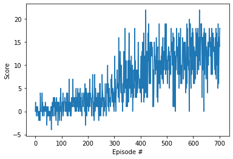

# Report

## Learning algorithm
The sample Deep Q-Network solution for 'LunarLander-v2' was used as a starting point for this
project (https://classroom.udacity.com/nanodegrees/nd893/parts/6b0c03a7-6667-4fcf-a9ed-dd41a2f76485/modules/e7499d4f-24f9-42ec-9864-23adcfa4e241/lessons/a6829f14-5ef0-4b4a-83ed-234029c5cc60/concepts/b3d7d025-6699-4f77-9b8b-8cb45042d14a .)
This sample solution, as-is, does allow to train the agent and obtain decent performance.
In fact, the agent can get to an average reward of about 11 at around the 900th episode (rolling 
average of latest 100 episodes.)

From that starting point, the following improvements were added:
1. Using Double DQN when evaluating Q-values (method 'q_targets' of class Agent.)
2. Implemented Prioritized Experience Replay (using
   implementation from https://github.com/rlcode/per)
3. Change the model architeture to Dueling DQN (model.py). 
   The neural network was kept small: 
   - The input state of dimension 37 goes into a sequence of 2 FC layer of 64 neurons.
    - We then split out the 2 heads: an extra FC layer (64 neurons) returns the advantages (dim=4)
    and another FC layer (64 neurons) returns the state-value (V). From these 2 heads, we compute
      the action-values (Q-function.)

From these improvements, the agent converges to that same average reward to 11 in less than
400 episodes.
(https://classroom.udacity.com/nanodegrees/nd893/parts/6b0c03a7-6667-4fcf-a9ed-dd41a2f76485/modules/e7499d4f-24f9-42ec-9864-23adcfa4e241/lessons/a6829f14-5ef0-4b4a-83ed-234029c5cc60/concepts/b3d7d025-6699-4f77-9b8b-8cb45042d14a .)

All hyper-parameters were either kept at their 'standard' values (ex: gamma=0.99) or simply 
'guessed' (ex: Dueling DQN architecture / #layers & #neurons.) Other than grid-search, it is not too
clear to me (yet) how to determine optimal hyper-parameter. I determined it would be a better use of
my time to implement double DQN/PER/dueling DQN than to try different hyper-parameters.

The value of these hyper-parameters are:
1. GAMMA = 0.99
2. BUFFER_SIZE = 100 000
3. BATCH_SIZE = 128
4. UPDATE_EVERY = 8
5. TAU = 1e-3
6. LR = 5e-4
7. ALPHA (prioritized experience replay): 0.4
8. BETA (prioritized experience replay): 0.6 (with increments of 1e-5 for each sampling, 
   until it reaches 1)
   
## Solving the environment
The average reward between episodes 604 and 703 is 13.01 . We can then say that the environment
was solved after episode 603.

## Plot of rewards

## Ideas for future work

I could most likely improve results by tuning hyper-parameters